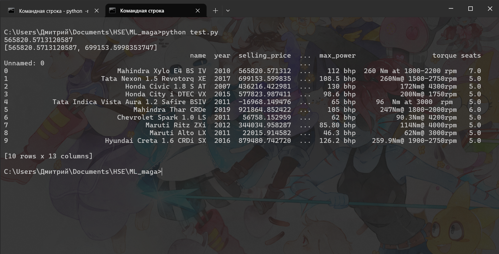

### Модель
В данной работе был проведен анализ данных (EDA), опробованы различные модели.

Изначально обучили линейную регрессию на вещественных признаках, затем попробовали стандартизировать признаки при помощи StandartScaler, однако качество можно сказать не изменилось. Аналогичная картина с Lasso регрессией с параметрами по умолчанию и подобранными через грид серч - регуляризация существенно ничего не поменяла, никакие признаки не занулила. Можно сказать все модели дали одинаковый результат в случае использования только лишь вещественных признаков.

Качество модели получилось улучшить добавив категориальные признаки - улучшили и r2 и MSE (оптимальные гиперпараметры тоже подбирали по сетке). При этом закодировав переменную name также получилось весьма неплохо улучшить качество.

### Сервис

Сервис на fastapi, по умолчанию работет на *localhost* порт *8000* и принимает 3 типа POST запросов: `/predict_item`, `/predict_items`, `/csv`.

Поднимаем сервис:
 ```
 python -m uvicorn main:app --reload
 ```

Можно протестировать при помощи утилиты curl:

```
curl -X POST -H "Content-Type: application/json" -d "{\"name\":\"Mahindra Xylo E4 BS IV\",\"year\":2010,\"km_driven\":168000,\"fuel\":\"Diesel\",\"seller_type\":\"Individual\",\"transmission\":\"Manual\",\"owner\":\"First Owner\",\"mileage\":\"14.0 kmpl\",\"engine\":\"2498 CC\",\"max_power\":\"112 bhp\",\"torque\":\"260 Nm at 1800-2200 rpm\",\"seats\":7.0}" localhost:8000/predict_item
```

```
curl -X POST -H "Content-Type: application/json" -d "[{\"name\":\"Mahindra Xylo E4 BS IV\",\"year\":2010,\"km_driven\":168000,\"fuel\":\"Diesel\",\"seller_type\":\"Individual\",\"transmission\":\"Manual\",\"owner\":\"First Owner\",\"mileage\":\"14.0 kmpl\",\"engine\":\"2498 CC\",\"max_power\":\"112 bhp\",\"torque\":\"260 Nm at 1800-2200 rpm\",\"seats\":7.0}, {\"name\":\"Tata Nexon 1.5 Revotorq XE\",\"year\":2017,\"km_driven\":25000,\"fuel\":\"Diesel\",\"seller_type\":\"Individual\",\"transmission\":\"Manual\",\"owner\":\"First Owner\",\"mileage\":\"21.5 kmpl\",\"engine\":\"1497 CC\",\"max_power\":\"108.5 bhp\",\"torque\":\"260Nm@ 1500-2750rpm\",\"seats\":5.0}]" localhost:8000/predict_items
```

```
curl -F file=@10.csv localhost:8000/csv
```

Также для тестирования сервиса есть отдельный скрипт test.py с assert-ами.

```
python test.py
```



Все работает,  возвращаемые значения корректные, ассерты проходит.
